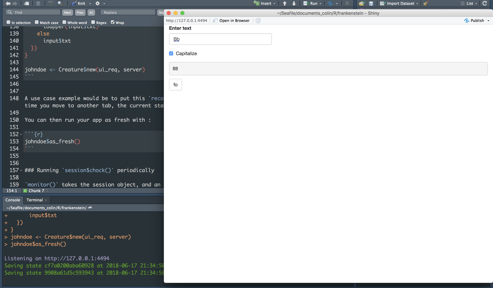
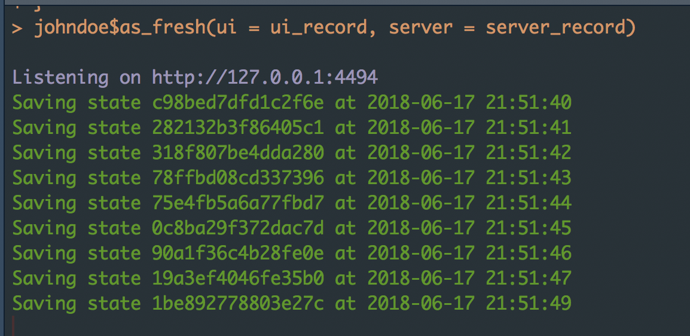

<!-- README.md is generated from README.Rmd. Please edit that file -->

[](https://www.tidyverse.org/lifecycle/#experimental)

# frankenstein

> Disclaimer: this is still highly experimental

{frankenstein} allows you to bring your shiny app back from the
dead.

<div data-align="center">

</img>

</div>

## Installation

You can install the released version of frankenstein from Github with:

``` r
remotes::install_github("Thinkr-open/frankenstein")
```

## Why frankenstein?

As a shiny developper, you sometime lose time re-navigating through your
app when it crashes. The goal of {frankenstein} is to allow you to bring
back you shiny app from the dead (i.e, to the last registered state).
All this, with minimal deviation from your usual shiny dev workflow.

### How is it different from shiny bookmark?

Shiny bookmark are useful from an interactive point of view: your user
has a pop up with the url of the restorable state. This is not what you
would want as a developer: you want the bookmark to be silent (no pop
up), and also to automatically restore the app from the last known state
(no copy and paste of the url).

### How can I make this work?

{frankenstein} relies on shiny bookmark, which need ui to be a function.
So if your app looks like this:

``` r
library(shiny)

ui <- fluidPage(
    textInput("txt", "Enter text"),
    checkboxInput("caps", "Capitalize"),
    verbatimTextOutput("out"),
    actionButton("fo","fo")
  )

server <- function(input, output, session) {
  observeEvent(input$fo, {
    session$doBookmark()
  })

  output$out <- renderText({
    if (input$caps)
      toupper(input$txt)
    else
      input$txt
  })
}

shinyApp(ui, server)
```

You’ll have to turn it to :

``` r

ui_req <- function(request) {
  fluidPage(
    textInput("txt", "Enter text"),
    checkboxInput("caps", "Capitalize"),
    verbatimTextOutput("out"),
    actionButton("fo","fo")
  )
}

server <- function(input, output, session) {
  observeEvent(input$fo, {
    session$doBookmark()
  })

  output$out <- renderText({
    if (input$caps)
      toupper(input$txt)
    else
      input$txt
  })
}
```

Note that the ui as function also works when calling shinyApp (but the
`session$chock` won’t).

``` r
shinyApp(ui_req, server)
```

### The Creature Object :

This object creates a new Frankenstein Creature from your ui and server:

``` r
library(frankenstein)
johndoe <- Creature$new(ui_req, server)
```

### About `record`

`record()` works as would \``session$doBookmark()`, with the little
difference that it doesn’t show a modal pop up, but instead print the id
of the bookmark to the console.

It takes the session as the only argument:

``` r
ui_req <- function(request) {
  fluidPage(
    textInput("txt", "Enter text"),
    checkboxInput("caps", "Capitalize"),
    verbatimTextOutput("out"),
    actionButton("fo","fo")
  )
}

server <- function(input, output, session) {
  observeEvent(input$fo, {
    record(session)
  })

  output$out <- renderText({
    if (input$caps)
      toupper(input$txt)
    else
      input$txt
  })
}

johndoe <- Creature$new(ui_req, server)
```

A use case example would be to put this `record` in a “next” button on a
shiny Dashboard, so that every time you move to another tab, the current
state is saved.

You can then run your app as fresh with :

``` r
johndoe$as_fresh()
```



You now have a list of states in your console, which you can get back
with :

``` r
johndoe$list_states()
#>                 id  last_modified_time
#> 1 63d9f8fcac13bf0d 2018-06-17 22:52:40
#> 2 bd3cdfa8dba957c1 2018-06-17 22:51:49
#> 3 50b5700711605123 2018-06-17 22:50:57
#> 4 3fe0ae7e6bae16d0 2018-06-17 22:19:36
#> 5 2d70fbbce8aa7770 2018-06-17 22:19:35
#> 6 0a12f58440b83ba8 2018-06-17 22:19:34
#> 7 f0de8671967d0078 2018-06-17 22:19:33
```

### Revive old shiny states

You can either revive from the last known state:

``` r
johndoe$revive()
```

Or from a specific state:

``` r
johndoe$revive(id = "3fe0ae7e6bae16d0")
```

### Running `record()` periodically

`monitor()` takes the session object, and an `intervalMs` argument,
which is the interval in milliseconds you want your session to be saved:

``` r
ui_record <- function(request) {
  fluidPage(
    textInput("txt", "Enter text"),
    checkboxInput("caps", "Capitalize"),
    verbatimTextOutput("out")
  )
}

server_record <- function(input, output, session) {
  
  monitor(session, 1000)
  
  output$out <- renderText({
    if (input$caps)
      toupper(input$txt)
    else
      input$txt
  })
}
```

To be more efficient memory-wise, `monitor()` only keeps the last states
by default, and flush all the others. You can prevent this behavior by
turning `dispose` to FALSE.

Note that this example will save a state each second.

### With new ui / server

When you call as\_fresh or revive without any argument, you’ll get the
ui and server used when the Creature object was created. If you pass a
ui and/or server to these methods, you’ll use these new elements. The
`overwrite` argument specifies wether or not the ui / server element
from self should be overwritten (default is TRUE)

``` r
johndoe$as_fresh(ui = ui_record, server = server_record)
```



### Flush states

If for example you’re saving every second, you can get a lot of states
in your folder.

You can dispose of your old bookmark with the `dispose` function. It can
either remove all states, or just keep the last known state.

**This function will remove all object from the folder, be cautious when
using it**.

``` r
johndoe$dispose(folder ="shiny_bookmarks", save_last = TRUE)
```

### Working with modules

As long as the main ui is a function, you can work with module.

``` r
frankUI <- function(id){
  ns <- NS(id)
    fluidPage(
      textInput(ns("txt"), "Enter text"),
      checkboxInput(ns("caps"), "Capitalize"),
      verbatimTextOutput(ns("out")), 
      actionButton(ns("fo"), "fo")
    )
}

frank <- function(input, output, session){
  observeEvent(input$fo, {
    session$chock()
  })

  output$out <- renderText({
    if (input$caps)
      toupper(input$txt)
    else
      input$txt
  })
}


ui <- function(request){
  fluidPage(
    frankUI("test")
  )
}

server <- function(input, output, session){
  callModule(frank, "test")
}

johndoe$as_fresh(ui, server)
```

## CoC

Please note that this project is released with a [Contributor Code of
Conduct](CODE_OF_CONDUCT.md). By participating in this project you agree
to abide by its terms.
